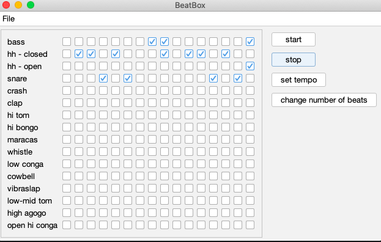

# 🥁 BeatBox

**BeatBox** is a Java-based desktop MIDI sequencer that lets users create and play simple beats using a visual
interface. Built with Java Swing and the javax.sound.midi package, this project demonstrates core concepts in
object-oriented programming, GUI development, and MIDI event handling.

This project was inspired by a tutorial in the Head First Java book.

## Table of Contents

- [Features](#features)
- [Screenshots](#screenshots)
- [How to Run](#how-to-run)
- [Design Patterns Implemented](#design-patterns-implemented)
- [License](#license)

## Features

- Visual grid to toggle beats for 16 different instruments
- Start/stop playback with real-time audio output
- Adjustable tempo, meter and looping playback
- Save and load beats to/from disk
- Uses standard MIDI percussion instruments

## Screenshots



## How to Run

### Prerequisites
- Java 8 or higher installed

### Run It
```bash
git clone https://github.com/tckelly/beatbox.git

cd beatbox

./mvnw compile exec:java
```

## Design Patterns Implemented

This project demonstrates the use of several design patterns:

- **Model–View–Controller (MVC)**: Separates concerns among data management (`BeatBoxModel`), user interface (`BeatBoxPanel`), and control logic (`BeatBoxController`).
- **Builder Pattern**: Utilized in `BeatBoxModel.Builder` for constructing model instances with customizable configurations.
- **Factory Method Pattern**: Implemented in `BeatBoxAppFactory` to encapsulate the creation logic of application components.
- **Prototype Pattern**: Employed in `BeatBoxController.getModelDefensiveCopy()` to create copies of the model for operations like saving and loading.
- **Command Pattern**: Action classes (`SaveAction`, `OpenAction`, `ExitAction`, etc.) encapsulate operations, promoting modularity and reusability.
- **Observer Pattern**: Used in `CheckBoxGridPanel` via multiple `ActionListener` implementations. The application's architecture supports future integration of observer mechanisms for completely responsive UI updates.
- **Data Transfer Object (DTO)**: The PlaybackData interface is used to expose only the playback state to the MIDI layer, keeping the model encapsulated.

## License

This project is licensed under the MIT License. See the [LICENSE](LICENSE) file for details.